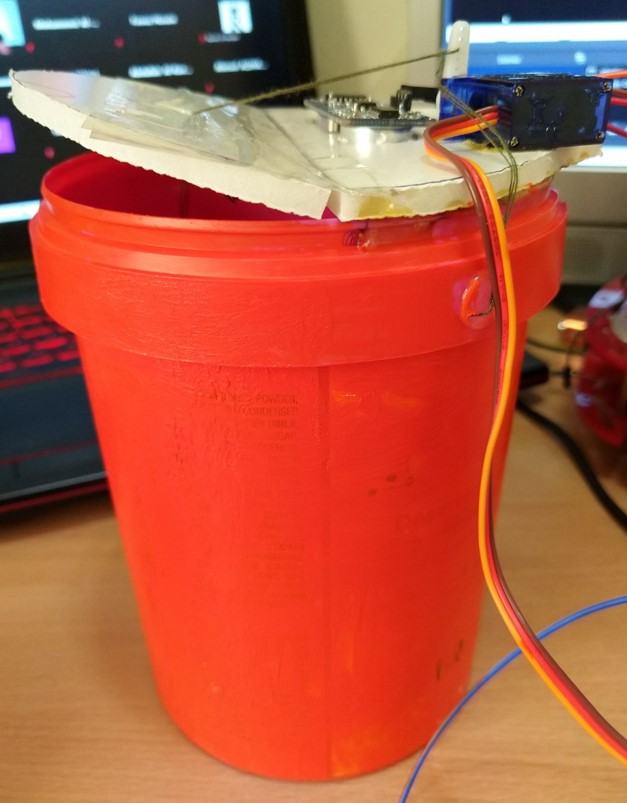
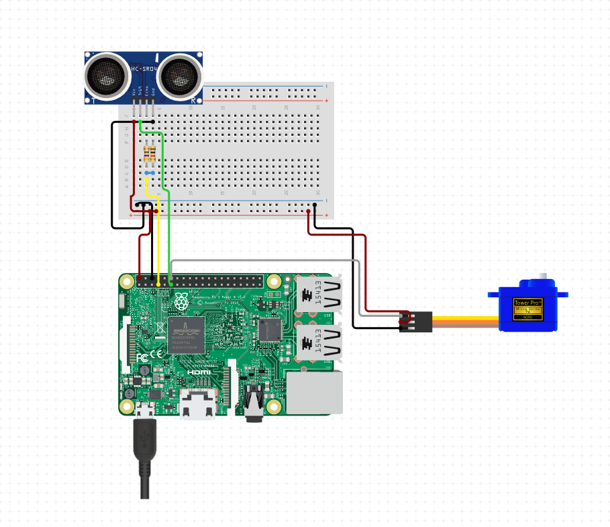

#  Smart Garbage Flow Control IOT system
---
This project was made for the Internet of Things Course. It is a smart IOT system that manages the garbage flow within a house and can be implemented on a city scale. It consists of 4 raspberry pies, one for the webserver, and three for each garbage bin. All the Raspberry pies need to be connected on the same network in order for the GPIO commands to be sent over the server. The project meant to use simple implementation and simple equipment but with maxiumum efficiency. All files need to be modified before usage. 

# Equipments
---
The project uses the following equipments:
  - 4x Raspberry pi 3B (3 for garbage bins and 1 for server)
  - 4x Servo motor "180 or 360 degrees" (1 per garbage bin)
  - 4x Ultrasonic Sensor "HC-SR04" (1 per garbage bin)
  - 4x Bread Board (1 per garbage bin)
  - 4x Garbage bins

# Features
---
  - Manages 3 garbage bins remotely from the weberver
  - Provides data analysis for each bin
  - Sends an email when garbage is full and closes the lid automatically
  - Opens garbage lid cover remotely to empty it.
  - Budget efficient as the equipments are not that expensive
  - Can be implemented on a city scale easily
# Files
---
- "posts" this file runs on each garbage bin to read the trash level and to control the lid and to send the data to the database to be analyzed.
- "db_interface" this is the main database where all the readings are stored. It uses MySQL database.
- "web-page" this file runs on the 4th raspberry pi as it is responsible for the webserver that controls all the grabage bins.

# Device & Component Integration
----
This is the final prototype:

This is the Component Integration:

# License
----

MIT

# Copyright Disclaimer
----

This project is the property of the developer and if used somewhere else the developer must be mentioned and tagged.

Developer:
-[@ayman](https://github.com/AymanKandil)
